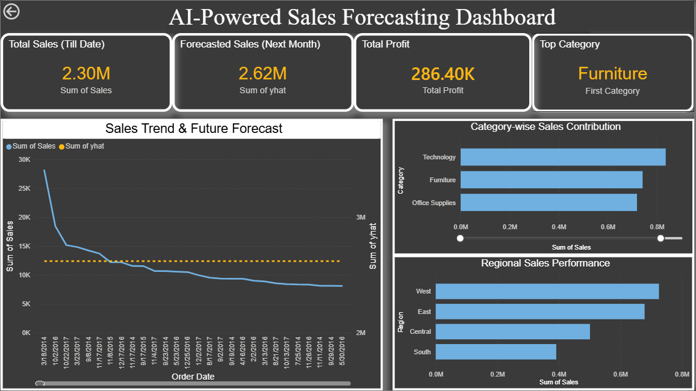

# FUTURE_ML_01  
## AI-Powered Sales Forecasting Dashboard

### 📌 Project Overview
This project focuses on building an AI-powered sales forecasting system using historical retail sales data.  
The goal is to predict future sales trends and present insights through an interactive Power BI dashboard.

---

### 🧠 Problem Statement
Retail businesses often struggle to predict future sales accurately, leading to poor inventory planning and missed revenue opportunities.  
This project uses Machine Learning-based time series forecasting to help businesses make data-driven decisions.

---

### 🛠️ Tools & Technologies
- Python (Pandas, Prophet)
- Jupyter Notebook / VS Code
- Power BI Desktop
- Excel / CSV datasets

---

### 📊 Workflow
1. Data cleaning and preprocessing using Python  
2. Aggregation of transactional data into monthly sales  
3. Time series forecasting using Facebook Prophet  
4. Exporting forecasted results for visualization  
5. Building an interactive Power BI dashboard  

---

### 🔮 Machine Learning Model
- Model Used: **Facebook Prophet**
- Forecasting Type: **Time Series Forecasting**
- Seasonality: Yearly
- Output:
  - Forecasted sales (`yhat`)
  - Confidence intervals (`yhat_lower`, `yhat_upper`)

---

### 📈 Dashboard Features
- Historical sales trend
- Actual vs Forecasted sales
- Monthly & yearly comparison
- KPI cards (Total Sales, Growth %)
- Business insights & recommendations

---

---

### 📸 Dashboard Preview

---

### 🚀 Key Learnings
- Practical application of Machine Learning in business
- Time series forecasting concepts
- Integration of Python ML output with Power BI
- Data storytelling for decision-making

---

### 👤 Author
**Prathibha B C**  
Future Interns – Machine Learning Task 1
